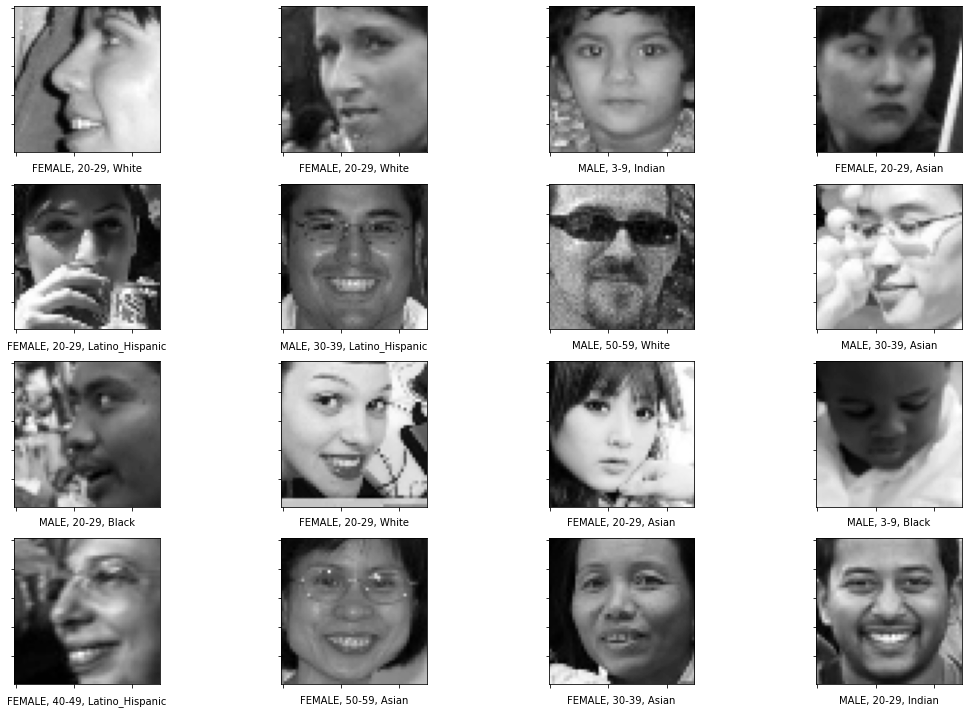
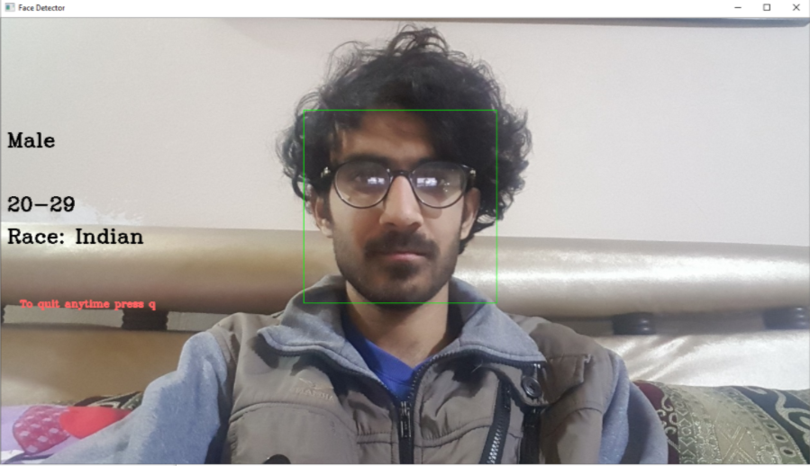

# age-race-gender-classification
Gender, Age and Race classification using deep convolutional neural networks on human facial images

### Image dataset
Download the datasets from following link:  
[training + validation](https://drive.google.com/file/d/1Z1RqRo0_JiavaZw2yzZG6WETdZQ8qX86/view)  
To preprocess the data and generate finaldf.pkl, run the data_preparation.py file or you can simple download  
the finaldf.pkl from here [finaldf.pkl](https://drive.google.com/file/d/1kKAdiioxzuujIN6iEmO1hSdR-Vgimddp/view)  

### Labels
Download the labels csv files:  
[train](https://drive.google.com/file/d/1i1L3Yqwaio7YSOCj7ftgk8ZZchPG7dmH/view)
[validation](https://drive.google.com/file/d/1wOdja-ezstMEp81tX1a-EYkFebev4h7D/view) 
### Preprocessed finaldf.pkl
[finaldf.pkl](https://drive.google.com/file/d/1kKAdiioxzuujIN6iEmO1hSdR-Vgimddp/view)  
### Predictions on validation data
Some of the predictions on the validation images are shown in the image below:
 
### Real time Prediction using webcam
To get a real time prediction of your age, race and gender, just run the predict.py file.  
Here are the results on my face: 

