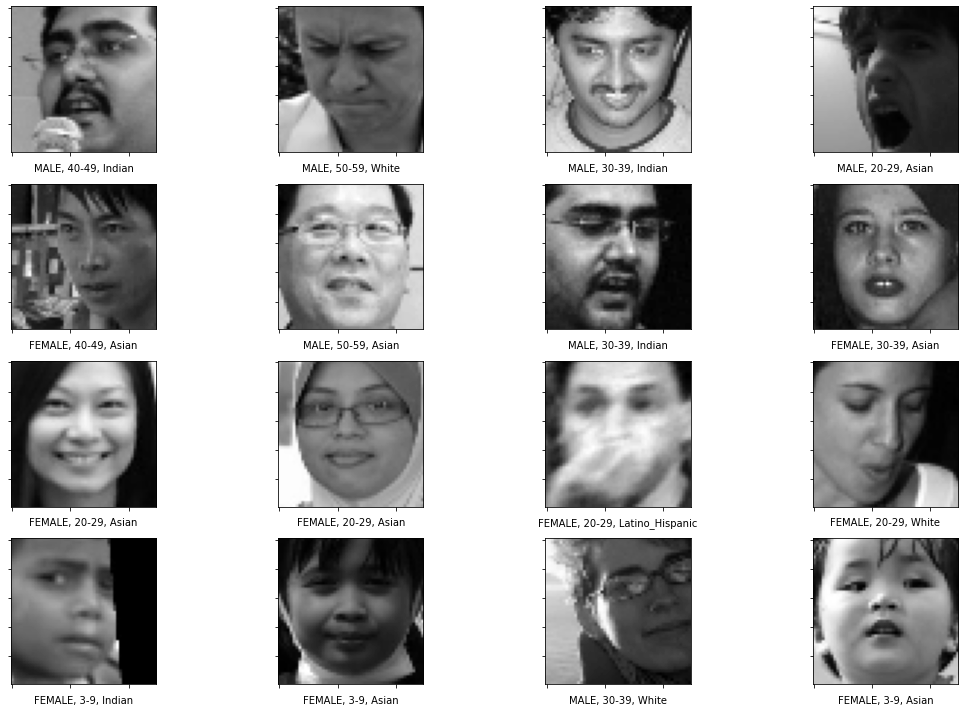

# age-race-gender-classification
Gender, Age and Race classification using deep convolutional neural networks on human facial images

#Data
### Image dataset
[training + validation](https://drive.google.com/file/d/1Z1RqRo0_JiavaZw2yzZG6WETdZQ8qX86/view)
### Labels
[train](https://drive.google.com/file/d/1i1L3Yqwaio7YSOCj7ftgk8ZZchPG7dmH/view)
[validation](https://drive.google.com/file/d/1wOdja-ezstMEp81tX1a-EYkFebev4h7D/view)
### Preprocessed finaldf.pkl
[finaldf.pkl](https://drive.google.com/file/d/1kKAdiioxzuujIN6iEmO1hSdR-Vgimddp/view)
### Predictions on validation data
Some of the predictions on the validation images are shown in the image below:

